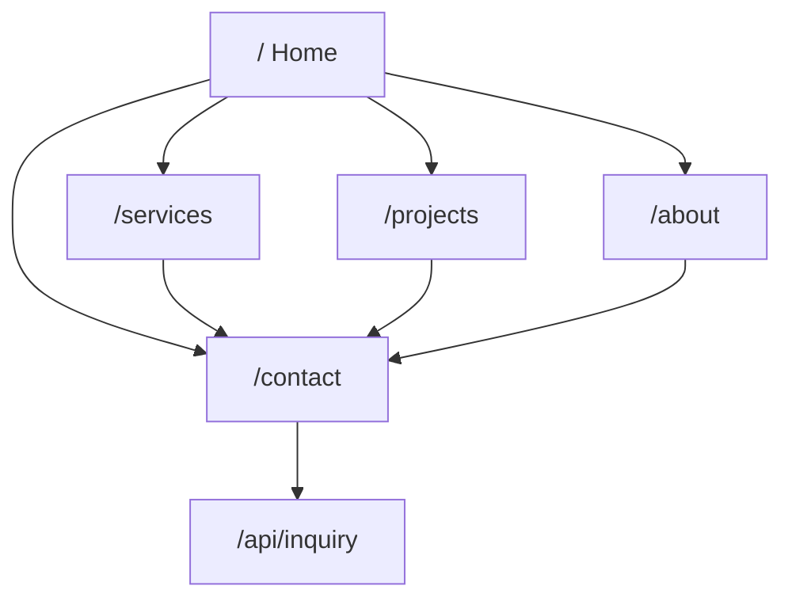
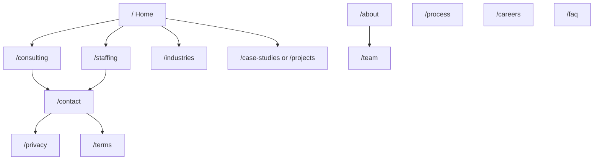
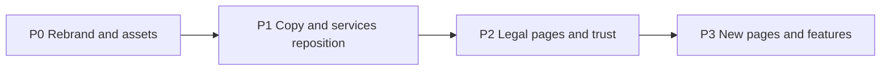

# SuperValue LLC — Site Audit & Rebrand Report

**Prepared for:** SuperValue LLC  
**Source repository:** `Portfolio_ByteWave` (originally InnoTech / ByteWave)  
**Date:** June 22, 2026  
**Business focus:** IT consulting + staffing/sourcing (broader than software build-only)

---

## 1. Executive Summary

### What the site is today

This repository is a **Next.js 16 App Router** marketing site for a remote software engineering collective. It has five public pages, a contact form backed by SendGrid, and a portfolio of demo projects. The tone is startup-oriented: “global remote collective,” “organic growth,” and “affordable development.”

**Branding is inconsistent:**

| Name | Where it appears |
|------|------------------|
| **InnoTech** | Navbar, footer, hero, about sections, root SEO metadata, README |
| **ByteWave** | Projects page metadata, 404 page metadata, internal documentation |

There are **no legal pages** (Privacy Policy, Terms of Service), and the About page explicitly states the team is **not a registered corporation** — language that must change for an LLC.

### What SuperValue LLC needs

SuperValue LLC requires a **professional, trust-oriented corporate site** that positions the company as an **IT consulting and talent sourcing partner**, not only a dev shop. Key shifts:

- Unified **SuperValue LLC** branding across UI, SEO, docs, and assets
- Copy that reflects **consulting, staffing, and project delivery** — not “startup collective”
- **Legal and trust infrastructure** appropriate for a registered LLC
- **New pages** for solutions, industries, team, careers, FAQ, and legal compliance
- **Functional contact pipeline** (current form has a submission bug)

### Effort estimate

| Workstream | Effort | Notes |
|------------|--------|-------|
| P0 Rebrand (name, assets, metadata, nav/footer) | 1–2 days | Blocked partially on logo/colors/domain |
| P1 Copy & positioning (services, about, portfolio) | 2–3 days | Requires SuperValue service definitions |
| P2 Legal & trust (privacy, terms, schema, form fix) | 1–2 days | Legal review recommended |
| P3 New pages (consulting, staffing, team, careers, FAQ) | 3–5 days | Can roll out incrementally |
| **Total (MVP launch)** | **~5–7 days** | P0 + P1 + P2 |
| **Total (full site)** | **~8–12 days** | Includes P3 |

---

## 2. Current Site Map

### Routes today

| Route | File | Purpose |
|-------|------|---------|
| `/` | `src/app/page.jsx` | Landing — Hero, Services preview, Projects preview, About teaser, CTA |
| `/services` | `src/app/services/page.jsx` | Full services catalog, tech stack, process, engagement models |
| `/projects` | `src/app/projects/page.jsx` | Portfolio grid (8 projects from data file) |
| `/about` | `src/app/about/page.jsx` | Company story, philosophy, positioning |
| `/contact` | `src/app/contact/page.jsx` | Inquiry form |
| `/api/inquiry` | `src/app/api/inquiry/route.js` | POST — Zod validation + SendGrid email |
| 404 | `src/app/not-found.jsx` | Custom not-found page |

### Navigation flow



### Proposed site map (target state)



---

## 3. Rebrand Inventory (File-by-File)

Priority key: **P0** = must change for LLC launch · **P1** = positioning & trust · **P2** = cleanup & polish

### P0 — Must change for LLC launch

| File | Current content | Recommended SuperValue replacement | Priority |
|------|-----------------|-------------------------------------|----------|
| [`src/app/layout.jsx`](src/app/layout.jsx) | `baseUrl = "https://innotech.samkiel.dev"` | `[TBD] https://supervalue.com` or production domain | P0 |
| | `title: "InnoTech \| Global Remote Software Engineering"` | `"SuperValue LLC \| IT Consulting & Talent Sourcing"` | P0 |
| | `template: "%s \| InnoTech"` | `"%s \| SuperValue LLC"` | P0 |
| | Description mentions “global remote collective” | Description emphasizing consulting, staffing, vetted talent, delivery partnerships | P0 |
| | `keywords: ["InnoTech", ...]` | `["SuperValue LLC", "IT consulting", "IT staffing", "talent sourcing", ...]` | P0 |
| | `authors/creator/publisher: "InnoTech Team"` | `"SuperValue LLC"` | P0 |
| | `siteName: "InnoTech"` | `"SuperValue LLC"` | P0 |
| | OG image alt: `"InnoTech - Engineering Judgment..."` | `"SuperValue LLC - IT Consulting & Talent Sourcing"` | P0 |
| | Twitter `@InnoTechTeams` | `[TBD] @SuperValueLLC` or official handle | P0 |
| | Icons: `/favicon.jpg` | `/favicon.[ext]` — new SuperValue favicon | P0 |
| [`src/components/layout/Navbar.jsx`](src/components/layout/Navbar.jsx) | Logo alt `"InnoTech Logo"`, brand text `InnoTech` | SuperValue logo + `"SuperValue"` or `"SuperValue LLC"` | P0 |
| | Nav links: Services, Projects, About, Contact | Add Solutions dropdown (Consulting, Staffing); rename Projects → Case Studies (optional) | P0 |
| [`src/components/layout/Footer.jsx`](src/components/layout/Footer.jsx) | Brand `InnoTech`, tagline about “engineering judgment” | SuperValue LLC tagline (see Section 4) | P0 |
| | `© {year} InnoTech. All rights reserved.` | `© {year} SuperValue LLC. All rights reserved.` | P0 |
| | Locations: Mandaluyong, Tijuana | **Confirm or replace** with SuperValue HQ / service regions | P0 |
| | Commented social: GitHub, X, `innotechteams@gmail.com` | Uncomment with SuperValue handles or remove | P0 |
| [`src/components/sections/Hero.jsx`](src/components/sections/Hero.jsx) | `"Engineering Future-Ready Digital Experiences"` | Headline focused on IT consulting & talent sourcing (see Section 4) | P0 |
| | `"InnoTech delivers fast, high-quality, and affordable..."` | SuperValue value proposition copy | P0 |
| | Image `/inno_logo.png` | `/supervalue-logo.png` or equivalent | P0 |
| [`src/components/sections/About.jsx`](src/components/sections/About.jsx) | `"About InnoTech"`, startup/collective copy | `"About SuperValue"`, LLC positioning | P0 |
| | Monogram `"IT"` (InnoTech) | `"SV"` or SuperValue logo mark | P0 |
| | Stats: Global/Remote, Organic/Skill-Based | e.g. Consultants Placed, Industries Served, Client Retention | P0 |
| [`src/app/about/page.jsx`](src/app/about/page.jsx) | Multiple `InnoTech` references in origin story | SuperValue LLC formation narrative | P0 |
| | **Critical:** `"InnoTech is not an official institution or a registered corporation yet..."` | Replace with registered LLC statement, confidentiality, compliance tone | P0 |
| | `"InnoTech is in its early stages, and we're currently launching"` | Mature LLC launch messaging | P0 |
| | CSS classes `innotech-accent`, `innotech-primary` | Rename when brand colors finalized | P1 |
| [`src/app/projects/page.jsx`](src/app/projects/page.jsx) | `"ByteWave Portfolio"`, `"Explore ByteWave's portfolio..."` | `"Case Studies \| SuperValue LLC"`, SuperValue description | P0 |
| [`src/app/not-found.jsx`](src/app/not-found.jsx) | `"404 - Not Found \| ByteWave"` | `"404 - Not Found \| SuperValue LLC"` | P0 |
| `public/` (missing from repo) | Referenced: `favicon.jpg`, `inno_logo.png`, `og-image.jpg`, `/projects/*.png` | Add SuperValue favicon, logo, OG image, curated case study images | P0 |
| [`package.json`](package.json) | `"name": "portfolio-innotech"` | `"portfolio-supervalue"` or `"supervalue-website"` | P0 |
| [`README.md`](README.md) | Full InnoTech branding, demo URL, clone URL | SuperValue LLC README, new domain, new repo URL | P0 |
| [`documentation.md`](documentation.md) | `"ByteWave Project Documentation"`, team credits | `"SuperValue LLC Project Documentation"` | P0 |

### P1 — Positioning & trust

| File | Current content | Recommended SuperValue replacement | Priority |
|------|-----------------|-------------------------------------|----------|
| [`src/app/services/page.jsx`](src/app/services/page.jsx) | Software-only: web, mobile, AI, cloud | Split or extend: IT Consulting, Staffing/Sourcing, Software Delivery | P1 |
| | `"Elite Engineering Services"` hero | `"Strategic IT Solutions & Talent"` or similar | P1 |
| | Engagement models: Fixed-Price, T&M, Dedicated Team | Add: Contract Staffing, Direct Hire, Managed Teams, Advisory Retainer | P1 |
| [`src/components/sections/Services.jsx`](src/components/sections/Services.jsx) | Web, Mobile, QA, Performance cards | Consulting, Staffing, Project Delivery, Managed Services cards | P1 |
| [`src/components/sections/CTA.jsx`](src/components/sections/CTA.jsx) | `"Ready to build the future of your business?"` | `"Ready to find the right IT talent or strategy?"` | P1 |
| | `bg-innotech-primary`, gradient `#0a192f` / `#e11d48` | SuperValue brand colors when available | P1 |
| [`src/app/contact/page.jsx`](src/app/contact/page.jsx) | `"Get In Touch"` only | Add inquiry context, office hours, response SLA | P1 |
| [`src/components/forms/InquiryForm.jsx`](src/components/forms/InquiryForm.jsx) | Project Type: Website, Mobile App, E-commerce | Inquiry Type: Consulting, Staffing, Software Project, Other | P1 |
| | No link to Privacy Policy | Add consent checkbox + link to `/privacy` | P1 |
| | **Bug:** Submit button uses `handleButtonClick` — shows fake success, never POSTs | Change to `type="submit"` or wire click to `handleSubmit(onSubmit)` | P1 |
| [`src/app/api/inquiry/route.js`](src/app/api/inquiry/route.js) | Validates name, email, projectType, budget, timeline, message | Add `inquiryType` field; route emails by type (optional) | P1 |
| [`libs/data/project.js`](libs/data/project.js) | 8 demo/portfolio projects | Curate as case studies; add `industry`, `engagementType`, `teamSize` fields | P1 |
| [`src/components/sections/Projects.jsx`](src/components/sections/Projects.jsx) | `"Professional Web & Software Solutions"` | `"Proven Results Across Industries"` | P1 |
| [`src/app/globals.css`](src/app/globals.css) | `.bg-innotech-primary` `#0a192f`, `.text-innotech-accent` `#e11d48` | `.bg-supervalue-primary`, `.text-supervalue-accent` with new palette | P1 |
| [`tailwind.config.js`](tailwind.config.js) | Custom primary/accent (generic) | Add SuperValue brand tokens when colors confirmed | P1 |
| [`libs/config.js`](libs/config.js) | `GA_MEASUREMENT_ID` from env only | New GA4 property for SuperValue; align with docs | P1 |
| Env vars | `SENDGRID_API_KEY`, `CONTACT_TO_EMAIL`, `CONTACT_FROM_EMAIL` | SuperValue business email addresses | P1 |

### P2 — Cleanup & polish

| File | Current content | Recommended action | Priority |
|------|-----------------|-------------------|----------|
| [`src/app/page.jsx`](src/app/page.jsx) | No page-level metadata | Add home-specific title/description for SuperValue | P2 |
| [`src/app/about/page.jsx`](src/app/about/page.jsx) | Inherits root metadata | Add `"About Us \| SuperValue LLC"` metadata export | P2 |
| [`src/app/contact/page.jsx`](src/app/contact/page.jsx) | Inherits root metadata | Add contact-specific metadata | P2 |
| [`src/app/services/page.jsx`](src/app/services/page.jsx) | Inherits root metadata | Add services-specific metadata | P2 |
| [`LICENSE`](LICENSE) | `Copyright [yyyy] [name of copyright owner]` placeholder | `Copyright 2026 SuperValue LLC` (after legal review) | P2 |
| [`1.md`](1.md) | Unrelated personal developer profile | Remove or move out of repo | P2 |
| [`2.md`](2.md) | Empty file | Remove | P2 |
| [`package-lock.json`](package-lock.json) | `"name": "portfolio-innotech"` | Updates automatically when `package.json` changes | P2 |

---

## 4. Suggested Copy Replacements

Draft copy uses `[TBD]` placeholders where SuperValue details are not yet confirmed.

### 4.1 Root metadata — `src/app/layout.jsx`

**Before:**
```
InnoTech | Global Remote Software Engineering
InnoTech is a global remote collective focused on building solid, usable digital products...
```

**After (draft):**
```
SuperValue LLC | IT Consulting & Talent Sourcing
SuperValue LLC helps businesses solve technology challenges through strategic IT consulting and vetted talent sourcing. We connect organizations with the right people and the right solutions—from advisory engagements to dedicated engineering teams.
```

### 4.2 Hero — `src/components/sections/Hero.jsx`

**Before:**
```
Engineering Future-Ready Digital Experiences
InnoTech delivers fast, high-quality, and affordable web and mobile development services. We scale your ideas into long-term digital solutions.
[Contact Our Team] [View our work]
```

**After (draft):**
```
The Right IT Talent. The Right Strategy. Delivered.
SuperValue LLC partners with businesses to source vetted IT professionals and deliver strategic consulting—from staff augmentation to full project delivery.
[Request a Consultation] [View Case Studies]
```

CTA links: `/contact` and `/projects` (or `/case-studies` when renamed).

### 4.3 Home About section — `src/components/sections/About.jsx`

**Before:**
```
About InnoTech
Engineering judgment for the modern age.
InnoTech is a global remote startup built on collaboration, skill, and a focus on human engineering mindset...
Global / Remote Team | Organic / Skill-Based Growth
Human Thinking. Solid Engineering. Real Products.
```

**After (draft):**
```
About SuperValue
Strategic IT partnerships built on trust.
SuperValue LLC is a registered limited liability company providing IT consulting and talent sourcing for businesses that need reliable technology outcomes—not just code.
[TBD stat] / Consultants Sourced | [TBD stat] / Industries Served
People First. Process Driven. Results Focused.
```

### 4.4 About page — critical legal block — `src/app/about/page.jsx`

**Before (lines 144–147):**
```
Honest Positioning
We believe in transparency. InnoTech is not an official institution or a registered corporation yet. We aren't backed by massive VCs or endorsed by major brands.
Growing through skill, not hype.
```

**After (draft):**
```
Who We Are
SuperValue LLC is a registered limited liability company [TBD: state of formation]. We operate with transparency, professional standards, and a commitment to client confidentiality. Our focus is long-term partnerships—not hype.
Built on expertise, accountability, and results.
```

### 4.5 About page — origin story — `src/app/about/page.jsx`

**Before:**
```
InnoTech began when a group of remote developers connected with a simple idea...
```

**After (draft):**
```
SuperValue LLC was formed to meet a growing need: businesses require both strategic IT guidance and access to vetted technical talent. What began as a focused team serving select clients has evolved into a full-service consulting and staffing firm serving [TBD: regions/industries].
```

### 4.6 Footer — `src/components/layout/Footer.jsx`

**Before:**
```
Engineering judgment and craftsmanship for talent teams and businesses. Built by professionals, focused on true problem solving.
© 2026 InnoTech. All rights reserved.
Mandaluyong, Philippines | Tijuana, Mexico
```

**After (draft):**
```
SuperValue LLC connects businesses with vetted IT talent and strategic consulting—built for scale, compliance, and long-term partnerships.
© 2026 SuperValue LLC. All rights reserved.
[TBD: HQ city, state] | [TBD: additional office or service region]
Privacy Policy | Terms of Service
```

### 4.7 CTA — `src/components/sections/CTA.jsx`

**Before:**
```
Ready to build the future of your business?
Get in touch today for a free consultation and quote. Our team is ready to scale your ideas into reality.
```

**After (draft):**
```
Ready to strengthen your IT team or strategy?
Schedule a consultation to discuss staffing, consulting, or project delivery. We'll match you with the right approach for your goals.
```

### 4.8 Projects metadata — `src/app/projects/page.jsx`

**Before:**
```
Software Development Projects | ByteWave Portfolio
Explore ByteWave's portfolio of professional web development projects...
```

**After (draft):**
```
Case Studies | SuperValue LLC
Explore how SuperValue LLC has helped clients through IT consulting, talent sourcing, and software delivery engagements.
```

### 4.9 Inquiry form — `src/components/forms/InquiryForm.jsx`

**Before:** Project Type dropdown (Website, Mobile App, E-commerce, Other)

**After (draft):** Inquiry Type dropdown:
- IT Consulting
- Staffing / Talent Sourcing
- Software Project
- Other

Add optional fields for staffing use cases:
- Roles needed (text)
- Team size / duration (text)
- Start timeline (existing field)

Consent line update:
```
We will never share your contact information. By submitting, you agree to our Privacy Policy and to be contacted about your inquiry.
```

---

## 5. Recommended New Pages

Aligned with SuperValue LLC's focus on **IT consulting + staffing/sourcing**.

| Page | Route | Purpose | Priority |
|------|-------|---------|----------|
| **IT Consulting** | `/consulting` | Advisory services: strategy, architecture review, digital transformation, vendor selection | P1 |
| **Staffing & Sourcing** | `/staffing` | Contract staffing, direct hire, managed teams, vetting process, roles placed | P1 |
| **Industries** | `/industries` | Verticals served (finance, healthcare, retail, SaaS, etc.) with tailored messaging | P2 |
| **How We Work** | `/process` | Engagement models, vetting pipeline, onboarding, SLAs (partially exists on `/services`) | P2 |
| **Case Studies** | `/case-studies` or enhanced `/projects` | Client outcomes, engagement type, team size, industry | P1 |
| **Team / Leadership** | `/team` | Leadership bios, credentials (currently only in `documentation.md`) | P2 |
| **Careers** | `/careers` | Join SuperValue + talent network / contractor signup | P2 |
| **FAQ** | `/faq` | Staffing process, rates, timelines, compliance, geographic coverage | P2 |
| **Privacy Policy** | `/privacy` | Required for inquiry form + GA analytics (noted in docs) | P1 |
| **Terms of Service** | `/terms` | Standard LLC service terms | P1 |
| **Partners** | `/partners` (optional) | Vendor/subcontractor onboarding for talent network | P3 |

### Navigation updates

**Navbar (proposed):**
```
SuperValue [logo]  |  Solutions ▾  |  Industries  |  Case Studies  |  About ▾  |  Contact
                     Consulting
                     Staffing
                                           About Us
                                           Team
                                           Careers
```

**Footer (proposed columns):**
- **Solutions:** Consulting, Staffing, Software Delivery
- **Company:** About, Team, Careers, Case Studies
- **Legal:** Privacy Policy, Terms of Service
- **Contact:** Email, locations, social links

---

## 6. Recommended New Features

### High value — launch phase

| Feature | Description | Files affected |
|---------|-------------|----------------|
| **Inquiry routing** | Add `inquiryType` (Consulting / Staffing / Software Project) to form + API; optionally route emails to different recipients | `InquiryForm.jsx`, `api/inquiry/route.js` |
| **Fix form submission bug** | Submit button currently triggers fake success via `handleButtonClick` without POSTing to API | `InquiryForm.jsx` lines 71–85, 187–208 |
| **Trust signals** | Client logo strip, testimonials, certifications on home page | New `src/components/sections/TrustSignals.jsx`, data file |
| **JSON-LD structured data** | `Organization` schema with legal name, URL, logo, contact | `src/app/layout.jsx` |
| **Cookie/consent banner** | Lightweight banner for GA compliance (referenced in `documentation.md`) | New component in layout |
| **Capability deck download** | PDF company profile in `public/supervalue-capability-statement.pdf` | Home CTA or footer link |
| **Per-page SEO metadata** | Unique titles/descriptions for all routes | Each `page.jsx` |

### Medium value — post-launch

| Feature | Description |
|---------|-------------|
| **Calendly / booking embed** | Schedule consultation directly from `/contact` |
| **Blog / Insights** | `/blog` for SEO and thought leadership on IT staffing trends |
| **Careers application form** | Separate from client inquiry — resume upload, role interest |
| **Testimonials data file** | JSON pattern matching `libs/data/project.js` |
| **Case study detail pages** | Dynamic route `/case-studies/[slug]` with full narrative |

### Lower priority

- Client portal link (external)
- Live chat widget
- Multi-language support (i18n)
- Partner/vendor onboarding portal

---

## 7. Technical Gaps to Address

| Issue | Location | Impact | Recommendation |
|-------|----------|--------|----------------|
| **`public/` folder absent** | Referenced throughout | Images 404 at runtime | Add favicon, logo, OG image, case study thumbnails before deploy |
| **InquiryForm submission bug** | `InquiryForm.jsx:71–85` | Users see "Successfully sent!" but no email is sent | Change button to `type="submit"`; remove `handleButtonClick` fake success |
| **Dual submit paths** | Form has `onSubmit` handler AND broken button click | Confusing UX | Single submit path via form `onSubmit` |
| **GA config mismatch** | `libs/config.js` vs `documentation.md` | Analytics may not fire if env unset | Align env var name; document `NEXT_PUBLIC_GA_MEASUREMENT_ID` |
| **No legal routes** | Site-wide | Compliance gap for LLC + form consent | Add `/privacy` and `/terms`; link from footer and form |
| **Branding split InnoTech/ByteWave** | Multiple files | SEO confusion, unprofessional | Unify to SuperValue LLC in one pass |
| **About page LLC disclaimer** | `about/page.jsx:146` | Contradicts LLC status | Replace immediately |
| **Commented social links** | `Footer.jsx:28–49` | Missing contact channels | Enable with SuperValue accounts or remove |
| **External images on Services** | `services/page.jsx` | CDN logos via raw `` — works but not optimized | Consider `next/image` with remote patterns in `next.config.mjs` |
| **Stray repo files** | `1.md`, `2.md` | Unrelated content in repo | Delete or gitignore |

---

## 8. Implementation Phases



### Phase 0 — Rebrand & assets (P0)

**Goal:** Site reads as SuperValue LLC everywhere; no InnoTech/ByteWave references.

- [ ] Add `public/` assets: favicon, logo, OG image
- [ ] Update `layout.jsx` metadata (URL, titles, OG, Twitter)
- [ ] Update Navbar + Footer branding and copyright
- [ ] Replace Hero, home About, CTA copy
- [ ] Rewrite About page; **remove unregistered corporation disclaimer**
- [ ] Fix ByteWave metadata on projects + 404 pages
- [ ] Update `package.json`, README, documentation.md

**Blockers:** Logo, favicon, production domain, brand colors.

### Phase 1 — Positioning & services (P1)

**Goal:** Site reflects consulting + staffing, not dev-shop-only.

- [ ] Rewrite `/services` with consulting + staffing pillars
- [ ] Update home Services section cards
- [ ] Extend inquiry form with inquiry type + staffing fields
- [ ] Fix form submission bug
- [ ] Curate portfolio → case studies in `libs/data/project.js`
- [ ] Rename CSS tokens `innotech-*` → `supervalue-*` when colors ready
- [ ] Configure SendGrid + GA for SuperValue

### Phase 2 — Legal & trust (P2)

**Goal:** LLC-appropriate compliance and credibility.

- [ ] Create `/privacy` and `/terms` pages
- [ ] Add footer legal links + form consent language
- [ ] Add JSON-LD Organization schema
- [ ] Add cookie/consent banner for analytics
- [ ] Add per-page SEO metadata
- [ ] Enable social/contact links in footer
- [ ] Add trust signals (logos, testimonials) when assets available

### Phase 3 — New pages & features (P3)

**Goal:** Full corporate site for IT consulting + staffing firm.

- [ ] `/consulting` and `/staffing` pages
- [ ] `/industries`, `/process`, `/faq`
- [ ] `/team`, `/careers`
- [ ] Optional: `/blog`, `/partners`, case study detail pages
- [ ] Capability deck PDF download
- [ ] Calendly embed on contact page

---

## 9. Information Needed from SuperValue

Because branding assets are **partial**, the following items should be confirmed before implementation:

| Item | Status | Used for |
|------|--------|----------|
| Production domain URL | `[TBD]` | `layout.jsx` baseUrl, canonical URLs, OG |
| Legal display name | SuperValue LLC (confirm) | Footer, legal pages, schema |
| State of LLC formation | `[TBD]` | About page, Terms |
| Logo (SVG/PNG) | Partial | Navbar, footer, hero, OG image |
| Favicon | `[TBD]` | Browser tab, PWA |
| OG / social share image (1200×630) | `[TBD]` | Social previews |
| Brand colors (primary, accent) | Partial | CSS tokens, Tailwind config |
| Official email | `[TBD]` | Footer, SendGrid, mailto fallback |
| Social handles (LinkedIn, X, GitHub) | `[TBD]` | Footer, metadata |
| HQ / office locations | `[TBD]` | Footer (currently PH + MX — confirm) |
| Service list (consulting offerings) | `[TBD]` | `/consulting` page |
| Staffing roles / industries | `[TBD]` | `/staffing`, `/industries` |
| Team bios & headshots | `[TBD]` | `/team` page |
| Client logos (with permission) | `[TBD]` | Trust signals |
| Testimonials | `[TBD]` | Home, case studies |
| SendGrid sender domain | `[TBD]` | Contact form delivery |
| GA4 measurement ID | `[TBD]` | Analytics |
| Capability statement PDF | `[TBD]` | Download link |

---

## 10. Appendix: Complete Brand Reference Search

All files containing legacy brand names:

| Search term | Files |
|-------------|-------|
| `InnoTech` | `layout.jsx`, `Navbar.jsx`, `Footer.jsx`, `Hero.jsx`, `About.jsx`, `about/page.jsx`, `README.md` |
| `ByteWave` | `projects/page.jsx`, `not-found.jsx`, `documentation.md` |
| `innotech` (lowercase) | `layout.jsx` (URL), `Footer.jsx` (email), `globals.css` (CSS classes), `package.json` |
| `InnoTechteam` / `@InnoTechTeams` | `Footer.jsx`, `layout.jsx`, `README.md` |

### Static assets to replace

| Current path | Used in |
|--------------|---------|
| `/favicon.jpg` | Navbar, Footer, layout icons |
| `/inno_logo.png` | Hero |
| `/og-image.jpg` | layout OG/Twitter |
| `/projects/*.png` | Portfolio grid (8 images) |

### Environment variables

| Variable | Purpose |
|----------|---------|
| `SENDGRID_API_KEY` | Email delivery via `/api/inquiry` |
| `CONTACT_TO_EMAIL` | Form recipient |
| `CONTACT_FROM_EMAIL` | Verified SendGrid sender |
| `GA_MEASUREMENT_ID` or `NEXT_PUBLIC_GA_MEASUREMENT_ID` | Google Analytics |

---

## 11. Summary & Next Steps

1. **Immediate:** Replace all InnoTech/ByteWave references and remove the “not a registered corporation” disclaimer.
2. **Before launch:** Add brand assets to `public/`, fix the contact form submission bug, create Privacy Policy and Terms pages.
3. **Positioning:** Reframe services and copy around IT consulting + staffing/sourcing.
4. **Growth:** Add `/consulting`, `/staffing`, `/team`, `/careers`, and `/faq` as the site matures.

Once the `[TBD]` items in Section 9 are provided, Phase 0 implementation can begin.

---

## 12. Required Must-Info Checklist (Before Content Update)

**Simple fill-in form:** [`SuperValue-Content-Form.md`](SuperValue-Content-Form.md)

Use this list when you are ready for the full rebrand. Items marked **BLOCKING** must be confirmed before launch; others can ship with placeholders and be refined later.

### A. Blocking — cannot launch without these

| # | Info needed | Example / format | Where it goes |
|---|-------------|------------------|---------------|
| 1 | **Legal entity name** (exact spelling) | `SuperValue LLC` | Footer, About, Privacy, Terms, SEO |
| 2 | **State of LLC formation** | `Delaware`, `Wyoming`, etc. | About page, Terms of Service |
| 3 | **Production website URL** | `https://www.supervalue.com` | Metadata, canonical URLs, OG tags, JSON-LD |
| 4 | **Primary business email** | `contact@supervalue.com` | Footer, contact form, SendGrid `CONTACT_TO_EMAIL` |
| 5 | **Logo file** | SVG or PNG, transparent background | Navbar, footer, hero |
| 6 | **Favicon** | 32×32 or 48×48 PNG/ICO | Browser tab, layout icons |
| 7 | **Brand colors** | Primary hex + accent hex (e.g. `#0a192f`, `#e11d48`) | CSS tokens, buttons, accents |
| 8 | **Office / service locations** | City, state/country (confirm or replace PH + MX) | Footer, Contact page |
| 9 | **One-line company tagline** | e.g. "IT consulting and talent sourcing for growing businesses" | Hero subtext, footer, OG description |
| 10 | **SendGrid setup** | API key + verified sender email/domain | Contact form delivery |

### B. Required for page copy — provide before writing new pages

| # | Info needed | Example / format | Where it goes |
|---|-------------|------------------|---------------|
| 11 | **Company origin story** (2–3 short paragraphs) | How SuperValue was formed, mission, who you serve | `/about` |
| 12 | **Consulting services list** | Strategy, architecture review, digital transformation, etc. | `/consulting`, `/services` |
| 13 | **Staffing services list** | Contract staffing, direct hire, managed teams, roles you place | `/staffing`, `/services` |
| 14 | **Industries served** | Finance, healthcare, retail, SaaS, etc. | `/industries`, home trust strip |
| 15 | **Engagement / pricing models** | T&M, fixed-price, dedicated team, retainer — what you offer | `/services`, `/process` |
| 16 | **How you vet talent** (brief process) | Screening steps, timeline, guarantees | `/staffing`, `/process`, `/faq` |
| 17 | **Target clients** | Startups, mid-market, enterprise — who should contact you | About, Hero, CTA copy |
| 18 | **Geographic coverage** | US-only, North America, global remote, etc. | About, FAQ, footer |

### C. Required for legal & trust pages

| # | Info needed | Example / format | Where it goes |
|---|-------------|------------------|---------------|
| 19 | **Privacy contact / DPO email** | `privacy@supervalue.com` or same as contact | `/privacy` |
| 20 | **Data collected via form** | Name, email, inquiry details — confirm list | `/privacy` |
| 21 | **Terms: governing law / jurisdiction** | State where LLC is registered | `/terms` |
| 22 | **Registered business address** (if public) | Mailing or registered agent address | Footer, Terms (optional) |
| 23 | **Cookie / analytics policy stance** | Use GA4 yes/no; consent required yes/no | Cookie banner, Privacy |

### D. Required for portfolio / case studies (curate or replace current 8 demos)

| # | Info needed | Example / format | Where it goes |
|---|-------------|------------------|---------------|
| 24 | **Case study selection** | Which projects to keep, remove, or replace | `/projects` |
| 25 | **Per case study:** client name (or anonymized) | "Fortune 500 retailer" or named with permission | Case study cards |
| 26 | **Per case study:** engagement type | Staffing / consulting / software delivery | Case study cards |
| 27 | **Per case study:** industry | Healthcare, fintech, etc. | Case study cards |
| 28 | **Per case study:** outcome (1 sentence) | "Placed 5 engineers in 30 days" | Case study cards |
| 29 | **Case study images** | Screenshot or branded graphic per entry | `public/projects/` |

### E. Required for team & careers (Phase 3 — can defer)

| # | Info needed | Example / format | Where it goes |
|---|-------------|------------------|---------------|
| 30 | **Leadership bios** | Name, title, 2–3 sentences, LinkedIn URL | `/team` |
| 31 | **Headshots** | JPG/PNG, consistent crop | `/team` |
| 32 | **Open roles or talent network CTA** | "We're hiring" vs "Join our contractor network" | `/careers` |
| 33 | **Careers contact or application method** | Email or form endpoint | `/careers` |

### F. Optional but recommended (placeholders OK at launch)

| # | Info needed | Used for |
|---|-------------|----------|
| 34 | OG / social share image (1200×630) | Link previews on LinkedIn, X, Slack |
| 35 | Social profile URLs (LinkedIn, X, GitHub) | Footer, metadata |
| 36 | Client logos (with written permission) | Home trust strip |
| 37 | Client testimonials (quote + name + company) | Home, case studies |
| 38 | Capability statement PDF | Download on home or footer |
| 39 | GA4 measurement ID | Analytics |
| 40 | Calendly or booking URL | Contact page embed |
| 41 | FAQ answers | Staffing rates, timelines, compliance, NDA process |

### G. Copy-paste template — fill in and send back

```
LEGAL & BRAND
- Legal name:
- State of formation:
- Website URL:
- Tagline:
- Primary email:
- Phone (optional):
- Office locations:
- Brand colors (primary / accent):
- Logo file: [attach or path]
- Favicon: [attach or path]

SERVICES
- Consulting offerings (bullet list):
- Staffing offerings (bullet list):
- Roles you typically place:
- Industries served:
- Engagement models:
- Geographic coverage:

COMPANY STORY
- Origin story (paragraph 1):
- Origin story (paragraph 2):
- Who we serve:
- What makes SuperValue different:

CASE STUDIES (repeat per project)
- Title:
- Client (named or anonymized):
- Industry:
- Engagement type:
- Outcome:
- Live link (if any):
- Image: [attach]

TEAM (repeat per person)
- Name:
- Title:
- Bio:
- LinkedIn:
- Photo: [attach]

LEGAL / OPS
- Privacy contact email:
- Governing law state:
- Registered address (if public):
- SendGrid sender email:
- GA4 ID (optional):
- Social URLs:
```

---

*Report generated from audit of `Portfolio_ByteWave` repository. Section 12 appended for pre-update content gathering.*
